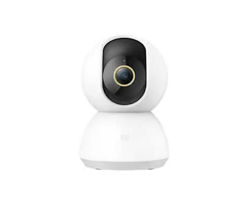

# Xiaomi Camera 360 Hacks (MJSXJxxCM)

- [Supported Cameras](#supported-cameras)
- [Features](#features)
- [Install Instructions](#install-instructions)

Keep calm and follow the procedure!

Warning: The method need to disassemble the camera and it brokes warranty. 

## Supported Cameras
For now this is it, I'm working on supporting more cameras.

Model Name(s) | Picture | Model Type | Uart
--- | --- | --- | --- 
MJXJ03CM||IPC003|[uart](mjxj03cm_uart.jpg)
MJSXJ01CM||IPC003|[uart](mjsxj01cm_uart.jpg)
MJSXJ02CM||IPC009|[uart](mjsxj02cm_uart.jpg)
MJSXJ03CM||IPC007A|[uart](mjsxj02cm_uart.jpg)
MJSXJ05CM||IPC019|[uart](mjsxj05cm_uart.jpg)
MJSXJ06CM||IPC021|[uart](mjsxj06cm_uart.jpg)
MJSXJ09CM||IPC029A|[uart](mjsxj09cm_uart.jpg)

- [Supported Cameras](#supported-cameras)
- [Features](#features)
- [Install Instructions](#install-instructions)

## Features
Feature | Telnet Server | Onvif Server | RTSP Server | SSH Server | Web Configuration Server
--- | --- | --- | --- | --- | ---
MJXJ03CM|[x]|||||
MJSXJ02CM|[x]|[x]|[x]||[x]|
MJSXJ05CM|[x]||[x]|||
MJSXJ06CM|[x]|||||
MJSXJ09CM|[x]|||||


## Install Instructions
1. According the model name and model type, download the rootfs_new.bin to sdcard (32GB, formated single partition with FAT32) then put into camera.
2. Wire out the UART and connect the uart of the camera via USB2TTL (115200, 8n1)
3. Stop uboot via keeping 'Enter' pressed then power up the camera.
4. Flash the hacked rootfs, enter the following commands after the prompt 'SigmaStar #' or 'GM #' of uboot shell.

MJSXJ02CM
```
fatload mmc 0:1 0x21000000 rootfs_new.bin
sf probe
sf erase 0x260000 0x674000
sf write 0x21000000 0x260000 0x674000
reset
```
MJSXJ05CM
```
fatload mmc 0:1 0x21000000 rootfs_new.bin
sf probe
sf erase 0x250000 0x69E000
sf write 0x21000000 0x250000 0x69E000
reset
```
MJSXJ06CM
```
fatload mmc 0:1 0x21000000 rootfs_new.bin
sf probe
sf erase 0x250000 0x69E000
sf write 0x21000000 0x250000 0x69E000
reset
```
5. enjoy the firmware with telnet enabled

## Install the hack apps
unzip the ipcxx_hacks.zip to sdcard


## Restore to original firmware
[Manual](https://www.imilab.com/news/221)